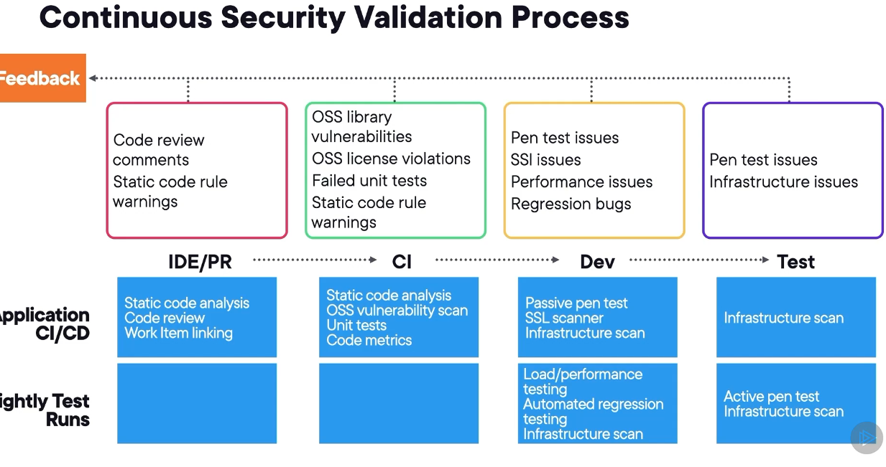

# continuous security validation process

1. pull requests
   1. review, 
   2. comments, 
   3. static code rule, 
   4. warning
2. CI
   1. oss library vulns
   2. static warnings
   3. failed unit tests
3. DEV
   1. pen test issue
   2. ssi issues
   3. performance issues
   4. regrassion bugs
4. TEST 
   1. pentest issues
   2. infrastructure issues

## application ci/cd
1. IDE/PR
   1. static code analysis
   2. code review
   3. work item linking
2. CI
   1. static code analysis
   2. unit tests
   3. code metrics
3. DEV
   1. passive pen test
   2. ssl scanner
   3. infra scan
4. TEST
   1. infra scan

## nightly test runs
1. DEV
   1. load/performance
   2. automated regression testing
   3. infrastructure scan
2. TEST
   1. active pen test
   2. infra scan

# security metrics
## defender for cloud
- defender for cloud devops security
  - central console
  - visibility: findings, vulns, scans, remediation instructions

# release management metrics
release pipeline overview widge on dashboards

# tracking feature usage post-deployment
- use app insights to track users/sessions/events/funnels
- funnels visualize users journey through the application
- user flows - most common paths users take through the app

# operations metrics
- performancew indicators
  - metrics like requests/latency/response times

# capacity planning metrics
- save money
- SLOs: service level objective
  - need SLI: service level indicators
  - create target: upper limit of desired performance for the timespan
- communicate the SLOs. it's not the SLA
## use scaling, vert/horiz